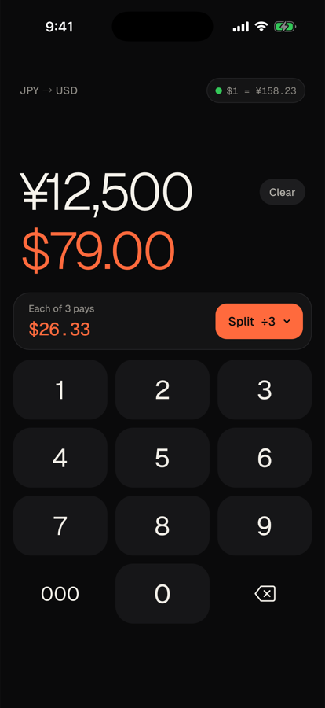

# Yen → USD

A small web app for converting yen to dollars and splitting the bill. It works offline once installed. Built from the Claude Design mock `Yen to USD.dc.html`.

**https://rosshettel.github.io/yen-to-usd/**

## Install on your iPhone

1. Open the link above in **Safari**.
2. Tap the **Share** button. On iOS 26 it's in the **⋯** menu next to the address bar.
3. Tap **Add to Home Screen**. You may need to tap **View More** to find it. Then tap **Add**.

It opens full screen from the home screen icon, like a regular app. On Android, open the link in Chrome and choose **Add to Home screen** from the menu.

## How it works

- **Rate:** fetched from [Frankfurter](https://frankfurter.dev), which is free and needs no API key. It's fetched on launch, whenever the app returns to the foreground, and when you tap the rate pill in the top right.
- **Fallback:** if the fetch fails, the app uses a fixed rate of `149.5` (`FALLBACK_RATE` in `web/index.html`).
- **Rate pill:** a **green** dot means a live rate and a **red** dot means the fallback.
- **Offline:** `web/sw.js` caches the page, icons and fonts, so the app opens with no signal. When you change the list of cached files, bump `CACHE` in `sw.js`. Edits to existing files show up on the second launch after a deploy.
- **Haptics:** Safari has no vibration API, so each keypad key is a `<label>` around a hidden `<input type="checkbox" switch>`. When a finger toggles a switch, iOS 18+ plays its toggle tick. Flipping the switch from code doesn't tick, so the tap has to land on the label. This is unofficial and may stop working in a future iOS. Android uses `navigator.vibrate`.

## Development

`web/` is plain HTML, CSS and JS with no build step.

- **Run locally:** `python3 -m http.server 8123 -d web`, then open http://localhost:8123.
- **Deploy:** every push to `main` that changes `web/` publishes it to GitHub Pages (`.github/workflows/pages.yml`).
- **Icons:** `scripts/make-icon.swift` renders the icon. Its header comment has the commands for resizing it into `web/icons/`.
